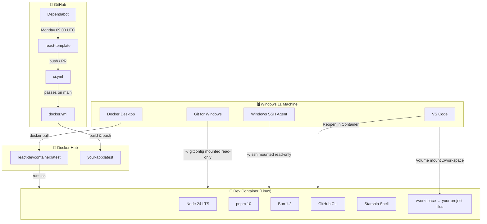
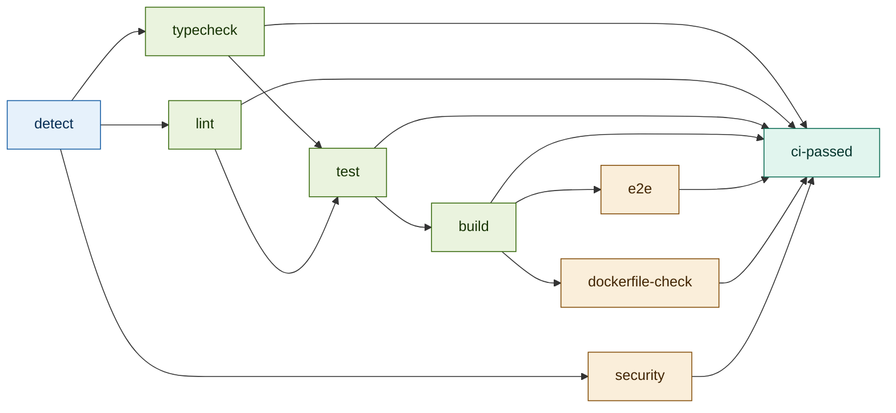
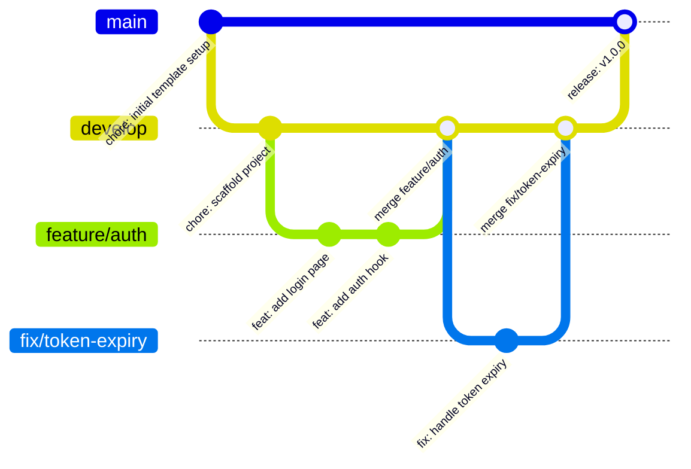

# react-template

GitHub Template repository. Every new React project starts from here.

> **This is a blank canvas.** No `src/`, no framework files, no React code.
> The template provides the developer toolchain only. You scaffold the project yourself.

---

## How to use

1. Click **"Use this template"** on GitHub → creates your new project repo
2. Clone it to your machine
3. Open in VS Code → **"Reopen in Container"**
4. The container pulls `ayayousef7/react-devcontainer:latest` from Docker Hub
5. Your entire project folder is mounted at `/workspace` — full two-way sync
6. Run `pnpm install` to activate Husky + commitlint git hooks
7. Scaffold your framework, then start coding

---

## Architecture



---

## What's included

| Path | Purpose |
|------|---------|
| `.devcontainer/devcontainer.json` | VS Code dev container config — pulls the pre-built image |
| `.github/workflows/ci.yml` | Three-tier CI pipeline (skips gracefully on a fresh template) |
| `.github/workflows/docker.yml` | Production image build — triggers after CI passes on `main` |
| `.github/workflows/dockerhub-description.yml` | Syncs README to Docker Hub on push to `main` |
| `.github/workflows/labels.yml` | Syncs GitHub labels from `.github/labels.yml` on push to `main` |
| `.github/dependabot.yml` | Auto-updates: Actions + Docker (LTS only) + npm (weekly, Monday 09:00 UTC) |
| `.github/labels.yml` | Label definitions for issues and pull requests |
| `.github/CODEOWNERS` | Auto-requests reviewer on every PR |
| `.husky/commit-msg` | Enforces Conventional Commits format via commitlint |
| `.husky/pre-commit` | Biome + TypeScript check + secret guard (skips if not scaffolded) |
| `.husky/pre-push` | Blocks direct push to `main` |
| `.vscode/extensions.json` | Windows-side extension recommendations (includes Dev Containers) |
| `.vscode/launch.json` | Debug configs — Chrome, Vitest, Playwright |
| `.vscode/tasks.json` | Task runner shortcuts |
| `docker/Dockerfile.prod` | Production image (Vite → Nginx, non-root) — placeholder, activates after scaffolding |
| `docker/nginx.conf` | SPA routing + caching + security headers — listens on port 8080 |
| `scripts/entrypoint.dev.sh` | SSH permission fixer + VS Code devcontainer sleep-infinity fallback |
| `scripts/welcome.sh` | Context-aware getting-started banner shown on container start |
| `commitlint.config.mjs` | Conventional Commits rules (ESM, Node 24 compatible) |
| `pnpm-workspace.yaml` | pnpm v10 settings (engineStrict, nodeLinker, supply-chain notes) |
| `.npmrc` | Auth and registry settings (engine-strict) |
| `.env.example` | Environment variable template |
| `.dockerignore` | Excludes dev-only files from the production image |
| `.gitignore` | Node · Docker · Windows · macOS · Linux |
| `docker-compose.yml` | Pulls dev image, mounts project, exposes `:5173` |
| `package.json` | Husky + commitlint only — no framework code |

---

## CI pipeline

Three-tier model — never fails on a fresh template.

| Tier | Condition | Active checks |
|------|-----------|---------------|
| 1 — Fresh template | No `pnpm-lock.yaml` | All skipped |
| 2 — Hooks only | `pnpm-lock.yaml` present, no `vite.config.ts` | `pnpm audit` |
| 3 — Full project | `pnpm-lock.yaml` + `vite.config.ts` present | typecheck + lint → test → build → e2e → dockerfile-check → audit |

### Job graph



`typecheck` and `lint` run in parallel after `detect`. The `test` job fans them both in — it only proceeds when both pass. This avoids the GitHub Actions "skipped needs" trap where a skipped optional job causes all downstream jobs to be skipped too.

The `ci-passed` job is the single required status check for branch protection. It evaluates all upstream results and exits correctly whether jobs ran or were skipped.

### Optional tool detection

The CI probes `pnpm-lock.yaml` for optional tools and skips gracefully if they are not yet installed:

| Output | Controls |
|--------|---------|
| `has-vitest` | Unit Tests job — skips with install hint if vitest absent |
| `has-playwright` | E2E Tests job — skips if `@playwright/test` absent |

### Production image

`docker.yml` triggers via `workflow_run` — only after CI passes on `main`. It guards on `vite.config.ts` presence before building, so it skips gracefully on a fresh template.

**Required GitHub Secrets:**

| Secret | Where to get it |
|--------|----------------|
| `DOCKERHUB_USERNAME` | Your Docker Hub username |
| `DOCKERHUB_TOKEN` | Docker Hub → Account Settings → Personal access tokens → Read & Write |
| `CODECOV_TOKEN` | [codecov.io](https://codecov.io) → your repo → Settings → token (optional) |

---

## Git hooks

Managed by [Husky v9](https://typicode.github.io/husky/). Run once after cloning:

```bash
pnpm install   # installs husky + commitlint and registers all git hooks
```

| Hook | Trigger | Purpose |
|------|---------|---------|
| `commit-msg` | Every `git commit` | Enforces Conventional Commits format |
| `pre-commit` | Every `git commit` | Biome + TypeScript check + secret guard |
| `pre-push` | Every `git push` | Blocks direct push to `main` |

**Valid commit types:** `feat` `fix` `docs` `style` `refactor` `perf` `test` `build` `ci` `chore` `revert` `wip`

---

## Git workflow



Direct push to `main` is blocked by the `pre-push` hook. Always use `feature/name` → `develop` → PR → `main`.

---

## Dependabot

Automated dependency updates run every Monday at 09:00 UTC targeting `main`.

| Ecosystem | Scope | Notes |
|-----------|-------|-------|
| `github-actions` | All Actions versions | Grouped into one PR |
| `docker` | Base images in `/docker` | Node bumps: LTS only (even-numbered releases) |
| `npm` | `/` — husky + commitlint | `@commitlint/*` grouped separately |

Node odd-numbered releases (21, 23, 25 …) are explicitly ignored — they have no long-term support and EOL in ~6 months. Bump Node manually when the next LTS drops.

---

## Dev image

| | |
|--|--|
| **Image** | `ayayousef7/react-devcontainer:latest` |
| **Source** | [`github.com/ayayousef2000/react-devcontainer`](https://github.com/ayayousef2000/react-devcontainer) |
| **Platforms** | `linux/amd64` · `linux/arm64` |
| **Contents** | Node 24 · pnpm · Bun · GitHub CLI · TypeScript · Starship |

---

## Deployment

Not included — add per project depending on your target:

| Target | Add to `.github/workflows/` |
|--------|----------------------------|
| Netlify | `deploy-netlify.yml` + `netlify.toml` |
| Vercel | `deploy-vercel.yml` |
| GCP Cloud Run | `deploy-cloudrun.yml` |
| AWS | `deploy-aws.yml` |
| Cloudflare Pages | `deploy-cloudflare.yml` |

---

## Related repositories

| Repo | Purpose |
|------|---------|
| [`react-devcontainer`](https://github.com/ayayousef2000/react-devcontainer) | Builds and publishes the base dev Docker image |
| [`react-template`](https://github.com/ayayousef2000/react-template) | ← You are here |

---

*Node 24 · pnpm 10 · Husky 9 · commitlint 20 · Biome 2 · 2026*
